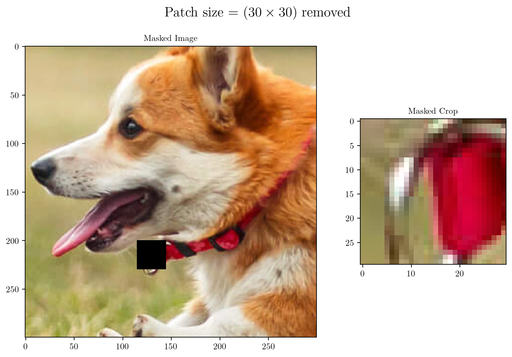
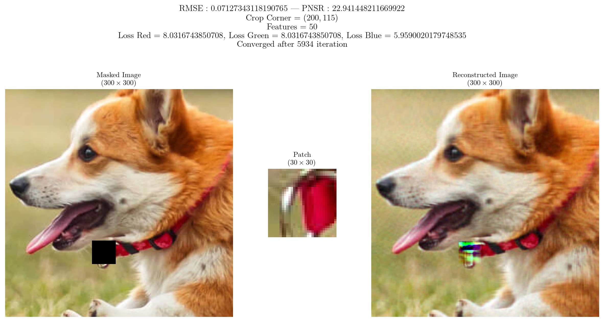
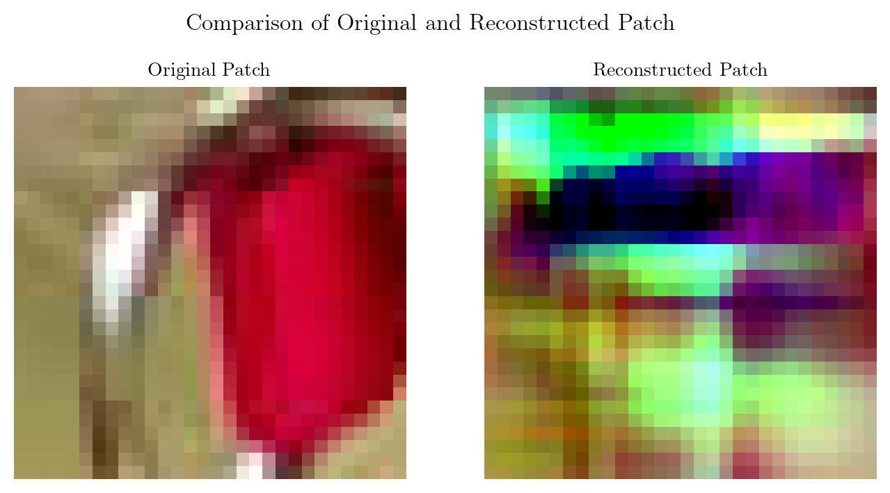
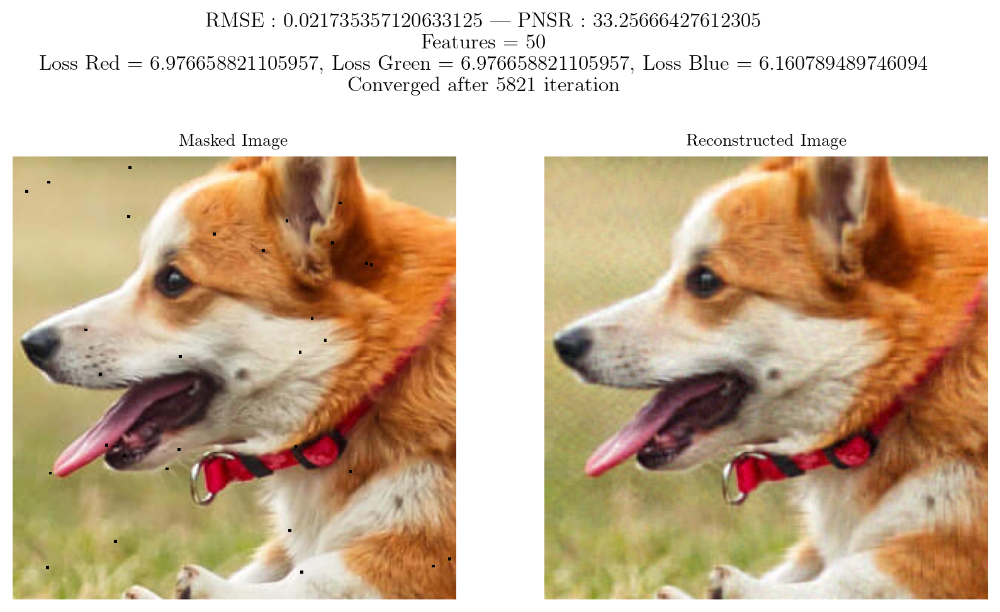
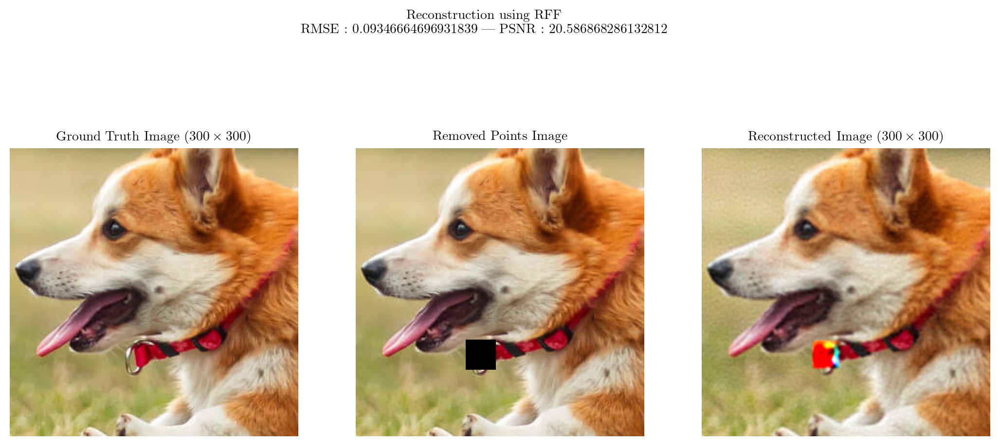
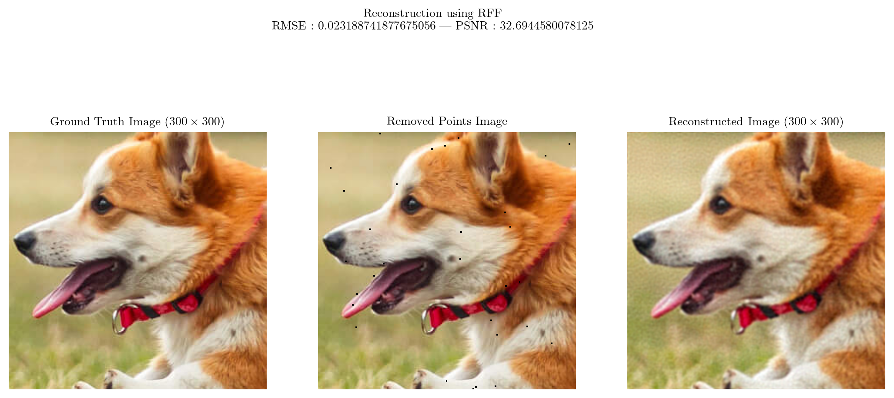

# Image Reconstruction

# Comaprison b/w Patch and Subset removed and reconstructed using Factorization

## $(30 \times 30)$ patch missing

## $\text{RMSE} = 0.07127 | \text{PSNR} = 22.941448$

### Removed Patch Image

### Reconstructed using Matrix Factorization

## $900$ points $(30 \times 30)$ missing

## $RMSE = 0.021735 | PSNR = 33.25666$

## Empty Subset

### Reconstructed using Factorization

## $RMSE_{subset} < RMSE_{patch}$ and $PNSR_{subset} > PSNR_{patch}$

### Thus removing the same number of points from a well distributed region does better reconstruction than removing the points from a localised region.

# Comaprison b/w Patch and Subset removed and reconstructed using RFF

## $(30 \times 30)$ Patch Missing

## $RMSE = 0.093466 | PSNR = 20.58686$

### Reconstructed Image using RFF

## $900$ points $(30 \times 30)$ missing

## $RMSE = 0.023188 | PSNR = 32.69445$

### Reconstructed Image using RFF

## $RMSE_{subset} < RMSE_{patch}$

## $PNSR_{subset} > PSNR_{patch}$

## ALSO

## $RMSE^{RFF}_{subset} < RMSE^{wh}_{subset}$

### Hence RFF does better reconstruction as compared to Matrix Factorization in the case of Subset Removal and in general, the reconstruction for subset removal is better than patch removal since points in the input space are sparsely missing, hence interpolation would be able to approximate well for the removed points as compared to an entire subset of the input space missing and the function basically giving a high biased prediction for the patch of missing points
